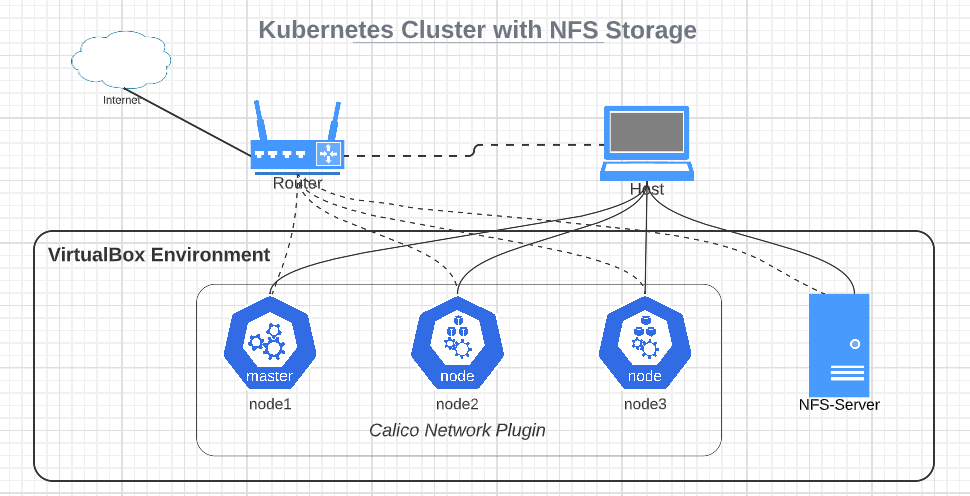

# Kubernetes Cluster
This is an automated solution for K8S cluster + NFS Storage created through `kubeadm` and Vagrant. Follow the steps below:
 - clone the repository; 
 - open the directory in terminal;
 - execute the command `vagrant up`;
 - wait until the cluster is ready.

You can install a different version of Kubernetes by changing the `box_version` settings in the Vagrantfile. The available box versions can be found here:
https://app.vagrantup.com/merev/boxes/k8s-node
#### Requirements:

 - Regular computar (Laptop or PC) with RAM 8+ GB, Disk: 80+ GB, and CPU: Intel/AMD x64 with virtualization support;
 - VirtualBox 6.1+:  https://www.virtualbox.org/wiki/Downloads;
 - Vagrant 2.1+:  https://developer.hashicorp.com/vagrant/downloads;

## Cluster Details
The architecture of the cluster looks like:

Every node in the cluster is based on the same Vagrant box (*merev/k8s-node*). You can find detailed information about the box here - https://app.vagrantup.com/merev/boxes/k8s-node.
### Nodes Information
The operating system installed on the nodes is Debian 11. Each node has 2 GB RAM, 2 CPUs, and 60 GB disk space. The hardware parameters can be adjusted before provisioning in the `config.vm.provider` block of the Vagrantfile. NFS-client is installed and a shared directory is mounted in the filesystem. The firewall is disabled. Every node has 2 network interfaces:
 - 1 NIC in NAT Mode - connected to the host machine;
 - 1 NIC in Bridge Mode - connected to the local network. (Cluster Network)

The second NIC (Bridge mode) of the nodes has a static IP address that belongs to my local network. Don't forget to replace the IPs of these interfaces with the ones that belong to your network (in the initial configuration scripts and Vagrantfile).

#### Warning: Setting the networks in the above way brings various security vulnerabilities and is STRONGLY NON-RECOMMENDED for production environment! However, it can be used for testing and exercises at home as well as when working with just a regular laptop.

Information about the installed software can be found in the box specification as well as in the node-preparation.sh script.

### Storage Information

The NFS Server is part of the same network and has the same parameters as the other VMs. NFS-server is installed and there is a directory shared with the Cluster Network.

### Initial Configuration
The initial configuration of the cluster contains the following actions:
 - Control Plane Initialization;
 - Network Plugin Installation; 
 - Adding the Worker Nodes;
 - Storage Configuration.

The additional configuration contains (not applied by default):
 - Running the K8s Dashboard;
 - Deploying 2-coponents test application (consumer-producer app).

You can have the additional configuration applied by uncommenting rows 54 and 55 in the Vagrantfile.
